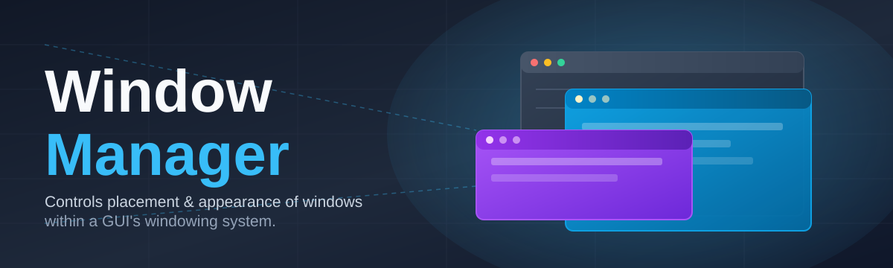
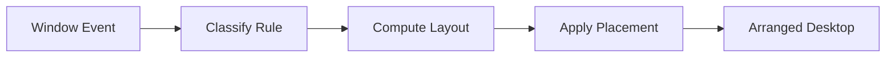

# window-manager-controller 🪟✨

  

| Requirement | Minimum |
|---|---|
| OS | Windows 10 (1903+) or Windows 11 |
| Architecture | x64 |
| RAM | 512 MB free |
| Disk space | ~15 MB |
| Dependencies | None — fully self-contained binary |
| .NET / runtime installs | Not required |

*A single-window-obsessed indie tool that finally makes Windows arrange itself the way your brain does.*

---

## 🔭 Overview

I built **window-manager-controller** because I got tired of dragging the same three app windows into the same three corners of my monitor every single morning. At its core, a window manager is the piece of system software sitting between your graphical shell and your applications — it decides where windows live, how they're sized, layered, snapped, and how they behave when you have twelve of them open and zero patience. Most desktop environments ship one baked in, but it's usually generic, and generic never fits a personal workflow.

This project is my attempt to build the window manager *I* actually wanted: something lightweight, keyboard-first, and opinionated enough to have a personality, without dragging in a widget toolkit, a background service farm, or a settings app the size of a small database. It talks directly to the Windows graphics and input stack, hooks into window placement events, and gives you deterministic, scriptable control over layout — tiling, snapping, focus-following, virtual-desktop-style grouping — all from one lean executable.

Who is this for? Power users who live in fifteen terminals and a browser with forty tabs. Developers who want reproducible window layouts every time they boot a project. Anyone who has ever manually resized a window and thought *"a computer should be doing this for me."* If that's you — welcome, this was basically written for you specifically.

> [!NOTE]
> This is a passion project maintained in evenings and weekends. It is stable, it is used daily by its author, and it is *not* going anywhere.

  

---

## 🧩 What It Actually Does

  

- **Deterministic tiling engine** — define a grid once, and every window that matches your rules snaps into its lane without you touching the mouse again.
- **Focus-follows-intent tracking** — the active window is chosen by where your attention actually goes, not just where the cursor happens to be idling.
- **Rule-based window binding** — assign specific apps to specific monitors, zones, or workspaces by title, class, or process name, and it sticks across reboots.
- **Layout snapshotting** — capture your current arrangement as a named profile and restore the exact same window positions later with one shortcut.
- **Multi-monitor awareness** — treats each display as its own zone-able canvas instead of pretending your setup is a single wide desktop.
- **Low-footprint background presence** — runs as a quiet resident process with negligible CPU draw when idle; it watches window events, it doesn't poll aggressively.
- **Hotkey-driven everything** — every action available in the settings panel also has a keyboard equivalent, because reaching for a mouse mid-flow is a workflow crime.
- **Zero external dependencies** — no bundled runtime, no companion installer, no silent background updater phoning home.

> [!TIP]
> Combine **layout snapshotting** with **rule-based binding** and you effectively get a "project mode" — one keypress restores your editor, terminal, and browser to the exact zones you left them in.

---

## 🚀 Getting Started

1. Visit the landing page and grab the current build using the download button above (or below — I'm not precious about which one you click).
2. Extract or run the downloaded executable — it's a standalone binary, so there's nothing to "install" in the traditional sense.
3. Launch it once; it will sit quietly in the system tray and start listening for window events immediately.
4. Open the settings panel (default hotkey `Win + Alt + S`) to set up your first zone layout, then start snapping windows.

> [!IMPORTANT]
> Run it once as a regular user first. If you need it to manage windows from elevated processes too, relaunch it "as administrator" — Windows will otherwise silently block cross-privilege window control.

---

## 🖥️ System Requirements

<strong>Full compatibility matrix (click to expand)</strong>

| Component | Requirement | Notes |
|---|---|---|
| Operating System | Windows 10 version 1903+ or Windows 11 | Earlier builds may partially work but are unsupported |
| Architecture | 64-bit (x64) | ARM64 runs via emulation but is untested at scale |
| Memory | 512 MB free | Idle usage typically well under this |
| Storage | ~15 MB | No temp cache growth over time |
| Graphics | Any GPU with standard DWM compositing | No dedicated GPU required |
| Input | Keyboard required; mouse optional | Fully operable via keyboard shortcuts |
| Dependencies | None | No .NET, no Java, no third-party runtimes |
| Permissions | Standard user | Administrator only needed for cross-privilege window control |

> [!WARNING]
> This tool targets **Windows only**. It does not run, and has no plans to run, on macOS or Linux window systems — those ecosystems already have excellent native managers of their own.

---

## ⚙️ How It Works

1. **Hook in** — the controller registers lightweight hooks into the windowing subsystem to receive window creation, move, resize, and focus events.
2. **Classify** — each incoming window is matched against your configured rules (title, class, process) to determine which zone or profile it belongs to.
3. **Compute layout** — the tiling engine calculates target coordinates for every managed window based on the active zone grid.
4. **Apply placement** — placement commands are sent back to the windowing system, repositioning and resizing windows near-instantly.
5. **Persist state** — the current arrangement is cached so it can be restored, snapshotted, or handed off to the next session.

---

## 🧯 Troubleshooting

**Q: My window snapped to the wrong zone — why?**
> Rule matching is priority-ordered top to bottom in your config. A broader rule higher up may be catching the window before your specific one gets a chance.

**Q: The app minimizes to tray but I can't get it back.**
> Use the default restore hotkey `Win + Alt + T`, or right-click the tray icon — left-click is reserved for quick-toggle of the last layout.

**Q: A game or fullscreen app went black after enabling zone snapping.**
> Add the process to the exclusion list in settings. Exclusive fullscreen apps generally shouldn't be zone-managed and this is expected behavior, not a bug.

**Q: Layouts don't restore correctly after a monitor is unplugged.**
> Snapshots are tied to monitor IDs. Reconnect the original display arrangement, or re-capture the snapshot on your new setup.

**Q: High DPI monitors show slightly misaligned window edges.**